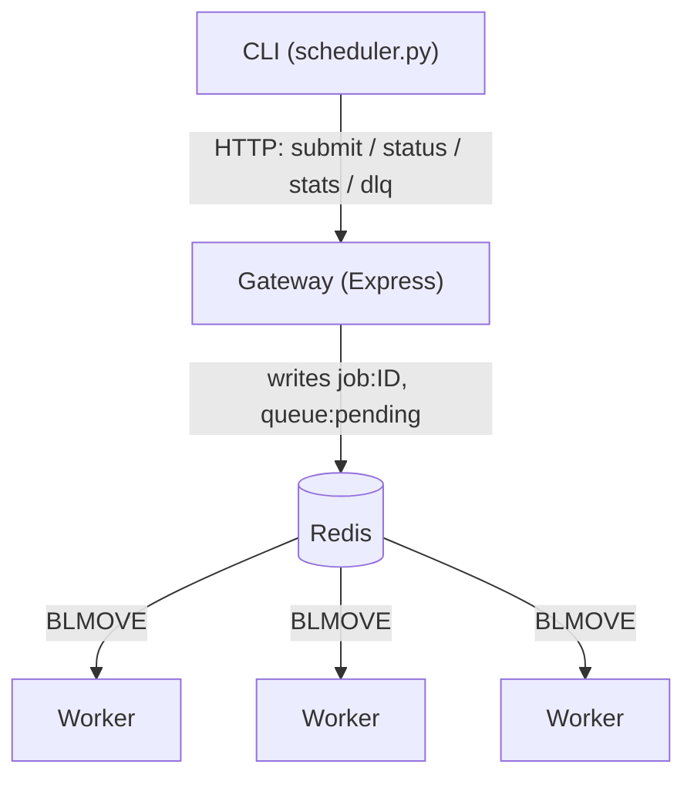

# Distributed Task Scheduler

A job scheduler that distributes background work across a pool of workers,
using Redis as both the message broker and the shared state store. Clients
submit jobs through a REST gateway and poll for status. A dynamic pool of
Python workers claims and executes them. Failed jobs retry with exponential
backoff and jitter. Workers that die mid-job have their work reclaimed via
heartbeat timeout, and jobs that exhaust retries land in a dead-letter queue.

There's no Celery, RQ, or BullMQ here on purpose. The queue mechanics —
atomic claiming, retry scheduling, heartbeat-based failure detection,
rate limiting — are implemented directly against Redis primitives (lists,
sorted sets, hashes, and a handful of Lua scripts where atomicity actually
matters) instead of delegated to a library. That's the point of the
project: understanding what those libraries are actually doing underneath.

> **Read [DECISIONS.md](./DECISIONS.md) before changing anything.** It's a
> log of every non-obvious choice made while building this — what was
> rejected, why, and exactly what fails if the choice turns out to be
> wrong. It's more useful than this file for understanding *why* the
> system looks the way it does, not just what it does.

## Architecture



Only the gateway and workers talk to Redis directly. The CLI only ever
talks HTTP to the gateway — two independent paths into job state would
drift, so there's exactly one. The three workers are identical peers, not
specialized in any way: each claims from the same `queue:pending`, and any
one of them can reclaim a job left behind by another (see "Watching a
worker die" below). What each side actually reads and writes in Redis —
job hashes, retry scheduling, heartbeats, rate limiting — is covered in the
[Redis keys](#redis-keys) table rather than crammed into this diagram.

## Quickstart

Requires Docker and Docker Compose. From the repo root:

```bash
docker compose up --scale worker=3
```

This starts Redis, the gateway (published on `localhost:3000`), and three
worker replicas, all sharing one queue. Scale the pool up or down anytime
with `--scale worker=N`.

In another terminal, use the CLI (Python 3, standard library only — no
install step):

```bash
python3 scheduler.py submit add 2 3
python3 scheduler.py status <job-id>
python3 scheduler.py stats
```

## Watching a worker die

The most interesting behavior in this system isn't visible unless you go
looking for it. With the pool up:

```bash
python3 scheduler.py submit slow 120
# Stop whichever replica actually claimed it -- check with
# `scheduler.py status <id>` first, it may not be worker-1.
docker stop task-scheduler-worker-1
```

Within ~15s, a different replica notices the stale heartbeat and reclaims
the orphaned job — no manual intervention, no lost work. Check again:

```bash
python3 scheduler.py status <job-id>
#   worker_id:  <a different id than before>
#   reclaims:   1
```

## CLI usage

The CLI talks to the gateway over `GATEWAY_URL` (default
`http://localhost:3000`) and never touches Redis directly.

```bash
# Enqueue a job, prints the job id
python3 scheduler.py submit <task> [arg ...]
python3 scheduler.py submit add 2 3
python3 scheduler.py submit echo "hello"

# Show a job's current state
python3 scheduler.py status <job-id>
#   job_id:     ...
#   task:       slow
#   status:     claimed
#   worker_id:  d0b5158b-9c45-4978-bf12-df15837255e0
#   attempts:   0
#   reclaims:   1
#   last_error: (none)

# Queue depth, live workers, DLQ size
python3 scheduler.py stats
#   pending:       0
#   workers_alive: 3
#   dlq:           0

# stats on a 1s refresh loop (Ctrl+C to exit)
python3 scheduler.py watch

# Dead-lettered jobs: id, task, attempts, reclaims, and why each died
python3 scheduler.py dlq [--limit N]
#   <job-id>  task=divide  attempts=0  reclaims=0  last_error=unknown task: divide
#
#   showing 1 of 1
```

`args` to `submit` are parsed as JSON where possible, so `submit add 2 3`
sends integers; anything that doesn't parse as JSON (`submit echo hello`)
is sent as a plain string.

## Redis keys

| Key | Type | Holds |
|---|---|---|
| `job:<id>` | Hash | Full job record — `task`, `args`, `status`, `attempts`, `reclaims`, `last_error`, `result`, `created_at`, `claimed_at`, `worker_id`, `next_attempt_at` (only the fields relevant to that job's current state are present) |
| `queue:pending` | List | Job ids waiting to be claimed. FIFO: `LPUSH` to enqueue, `BLMOVE` pops from the tail |
| `processing:<worker_id>` | List | The job id currently claimed by that worker — the durable record of who's holding what, independent of the job hash |
| `retry:scheduled` | Sorted Set | Job ids waiting out backoff before their next attempt; score = eligible unix timestamp |
| `queue:dead` | List | Job ids that exhausted retries, hit a permanent failure (`PermanentError` or an unknown task), or exceeded max reclaims |
| `workers:heartbeats` | Sorted Set | Every live worker id; score = its last heartbeat's unix timestamp |
| `ratelimit:<ip>` | Hash | Token bucket state for one client IP — `tokens`, `last_refill` |

## Design tradeoffs

Each of these is a deliberate choice, not an oversight — full reasoning and
the exact failure scenario for each is in DECISIONS.md.

- **At-least-once delivery has a real fencing gap.** A worker wrongly
  declared dead (a GC pause, a network blip to Redis) can still be alive
  and executing; its job gets reclaimed and re-run by another worker while
  the first is still going — a genuine violation of "two workers never run
  the same job concurrently," not just a theoretical one. A
  compare-before-write check narrows the window from a job's entire
  runtime down to one round trip, but the real fix — a fencing token,
  checked-and-incremented atomically on every claim — is meaningfully
  bigger machinery than this project takes on, so idempotent task handlers
  are what actually keep this safe rather than the scheduler closing the
  gap itself.
- **There's no graceful shutdown.** Stopping a worker container,
  intentionally or not, always sends its in-flight job through the same
  ~15s heartbeat timeout and reclaim path a hard crash would, rather than
  finishing the current job first — skipped deliberately, because a hard
  kill is already fully recoverable and handled identically either way; a
  handler here would only save latency on routine stops, not fix a
  correctness gap that doesn't exist.
- **Backpressure doesn't know the pool's actual capacity.** The queue-depth
  threshold that trips a `503`, and its flat `Retry-After`, are both single
  constants with no relationship to worker count or real drain rate,
  because computing that properly means measuring live worker throughput —
  more machinery than a threshold this project can just tune by hand needs.
- **The job schema is duplicated across languages, with nothing to catch
  drift.** Both `gateway.js` and `worker.py` independently write and read
  the same job hash shape, and `HEARTBEAT_TIMEOUT_SECONDS` is defined
  separately in both, because a shared schema file or a single writer of
  job state is real infrastructure this project doesn't otherwise need,
  and two small values weren't judged worth building it for.
